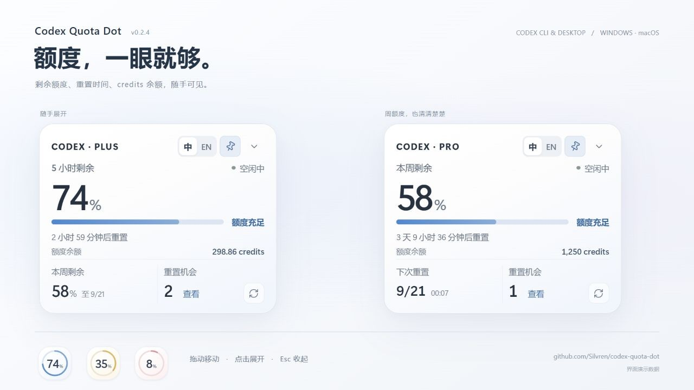

# Codex Quota Dot

**Keep your Codex quota in sight, not another browser tab.**

A lightweight, privacy-first **Codex CLI and Codex Desktop quota widget for Windows and macOS**. See remaining usage, weekly limits and reset times in a small floating orb.

[简体中文](README.zh-CN.md) · [Download](https://github.com/Silvren/codex-quota-dot/releases/latest) · [Report a bug](https://github.com/Silvren/codex-quota-dot/issues/new/choose)

[](https://github.com/Silvren/codex-quota-dot/releases/latest)
[](https://github.com/Silvren/codex-quota-dot/actions/workflows/ci.yml)
[](LICENSE)

> This is an independent open-source project and is not affiliated with or endorsed by OpenAI.

中文简介：一个轻量、隐私优先的 Codex 配额桌面悬浮球，无需打开用量页面即可查看当前可用的短周期或每周额度、重置时间和消耗状态。

## Interface preview



The surface changes with the active quota window: blue for healthy (`50–100%`), amber for caution (`10–50%`), and coral for critical (`0–10%`). If Codex omits the short window, the orb falls back to weekly quota and displays a `周` / `W` marker.

## Download

Download the latest build from [GitHub Releases](https://github.com/Silvren/codex-quota-dot/releases/latest):

- Windows x64
- macOS Apple Silicon
- macOS Intel

> **Release signing:** current packages are not code-signed. Windows SmartScreen or antivirus software may therefore show a reputation or heuristic warning. Download only from this repository's GitHub Releases page, verify the accompanying `.sha256` file, and do not disable security software or add an exclusion just to run the app. See [Windows download safety](docs/windows-download-safety.md) for verification steps and reporting guidance.

## Current status

`v0.2.3` adapts to the quota periods Codex actually returns, including weekly-only accounts. It retains the compact interface, reset-credit expiration details, and explicit cached/error states. Windows x64 and both macOS architectures have passing release builds.

### Start in three steps

1. Install Codex Desktop or Codex CLI and sign in there. This widget does not ask for your credentials.
2. Download the package for your OS from [Releases](https://github.com/Silvren/codex-quota-dot/releases/latest). Windows users can choose the installer or extract the portable ZIP; macOS users should choose Apple Silicon or Intel.
3. Launch Codex Quota Dot. **Drag to move, click to expand, Esc to collapse.** Hover does not open the card.

For CLI-only setups, `codex` must be available on PATH, or set `CODEX_BINARY` to its executable before starting the widget. If both Desktop and CLI are installed, the widget prefers the Desktop binary unless `CODEX_BINARY` is set. Quota availability depends on the account and the installed Codex version.

### What it shows

- ChatGPT plan reported by Codex
- the currently available short-period and weekly quota windows
- reset times and overall health
- individual reset-credit expiration dates, shown in local time and sorted earliest first
- best-effort `consuming` / `idle` inference from successive quota changes
- last-update and honest cached/unknown states

The compact **56 px quota orb** stays on top and shows the active quota percentage. Drag it to reposition and snap it to a screen edge; click it to open the **320 × 256 quota card**. Hover never opens or closes the card. Use the explicit collapse control or press `Esc` to return to the orb. The card includes Chinese/English switching and a clearly indicated always-on-top toggle. Sizes are logical pixels and follow OS display scaling.

The runtime has just three frontend dependencies (React, React DOM and the Tauri API); the three control icons are inline SVG. There is no bundled browser, sync service, mobile client, telemetry, or extra server in this desktop release.

## Quota-window availability

Codex Quota Dot is not restricted to Plus: it reads the actual quota windows returned for the signed-in account, including Pro. Their presence and duration can vary by plan, workspace, promotion, and rollout.

- With multiple usable windows, the shortest reported period is the main display and the other appears in the footer. Labels follow the reported duration rather than assuming five hours.
- With only a weekly window, the orb displays the weekly value with a `周` / `W` marker. The card shows the weekly percentage, countdown, and local reset date/time; it does not show a misleading missing-five-hour warning.
- Other reported durations are supported too. A window without a duration is labeled simply “Quota remaining”.
- With no usable percentage, the app stays neutral and shows unavailable data. Missing windows are **not** interpreted as unlimited usage, 100% remaining, or a failed login.
- Older cached snapshots remain readable and are clearly marked as saved data.

中文说明：Plus、Pro 等套餐统一按实际返回的额度周期显示。没有五小时窗口但有周额度时，正常展示周额度和重置时间；没有返回数据不等于无限额度。

This project does not claim that OpenAI has permanently or universally removed a specific quota window. See [official pricing and usage guidance](https://learn.chatgpt.com/docs/pricing).

## Privacy design

The native backend starts the installed `codex app-server` and calls its documented `account/read` and `account/rateLimits/read` JSON-RPC methods. Codex itself owns authentication. This app:

- never reads or copies `auth.json`, tokens, cookies, conversations, session rollouts, or project files;
- never passes credentials to the WebView;
- stores only settings, position, and the normalized usage snapshot in WebView local storage;
- has no telemetry, analytics, ads, crash upload, or project server;
- discards Codex subprocess logs and never logs raw account responses.

Codex may contact OpenAI to obtain the usage snapshot, as it normally does. See [`docs/privacy.md`](docs/privacy.md) and [`docs/data-source-research.md`](docs/data-source-research.md).

## Development

Prerequisites:

- Node.js 22+
- Rust stable
- the [Tauri 2 platform prerequisites](https://v2.tauri.app/start/prerequisites/)
- Codex Desktop or Codex CLI available as `codex` (or set `CODEX_BINARY` to its executable)

```powershell
npm install
npm test
npm run typecheck
npm run tauri dev
```

Browser-only preview:

```powershell
npm run dev
```

The browser preview intentionally uses labeled mock data. Native builds never silently fall back to mock values.

Production build:

```powershell
npm run tauri build
```

## Known limitations

- Rust/native build verification is required on every target OS; WebView behavior differs across Windows and macOS.
- Each refresh currently starts a short-lived app-server subprocess. A future release may reuse the supported local daemon transport after lifecycle behavior is validated.
- Passing macOS builds do not cover every native interaction, multi-monitor layout, or DPI setting.
- Start-at-login and a full settings screen are intentionally not included; the widget keeps controls limited to language, always-on-top, reset-credit details, and refresh.
- `consuming` is inferred from a decrease between snapshots. It does not mean a Codex task is definitely running.
- The provider depends on the installed Codex version exposing the documented app-server account methods. Structural changes fail closed as `Unknown`.

## Documentation

- [`docs/architecture.md`](docs/architecture.md)
- [`docs/data-source-research.md`](docs/data-source-research.md)
- [`docs/privacy.md`](docs/privacy.md)
- [`docs/security-model.md`](docs/security-model.md)
- [`docs/windows-download-safety.md`](docs/windows-download-safety.md)
- [`docs/releasing.md`](docs/releasing.md)
- [`CONTRIBUTING.md`](CONTRIBUTING.md)
- [`SECURITY.md`](SECURITY.md)
- [`THIRD_PARTY_NOTICES.md`](THIRD_PARTY_NOTICES.md)

## License

[MIT](LICENSE). It is short, permissive, and appropriate for a small cross-platform utility.
