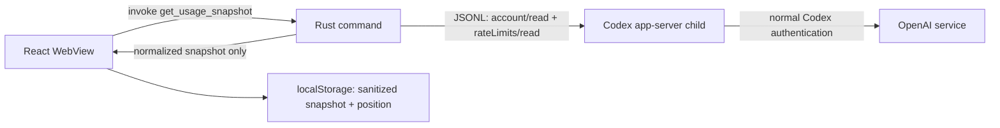

# Architecture

## Framework decision

Tauri 2 was selected over Electron.

Both provide transparent frameless windows, always-on-top behavior, tray menus, and packaging. Electron bundles Chromium and uses a Chromium-style multi-process model; that is robust but heavier than needed for one 320 px card. Tauri uses the operating system WebView and a small Rust backend, while its capability files constrain renderer access to explicitly granted window operations. Those characteristics better match the low-idle-cost and narrow-security-boundary goals.

References: [Tauri capabilities](https://v2.tauri.app/security/capabilities/), [Electron process model](https://www.electronjs.org/docs/latest/tutorial/process-model), [Electron transparent-window limits](https://www.electronjs.org/docs/latest/tutorial/custom-window-styles).

Trade-offs:

- Tauri requires Rust and OS-specific WebView toolchains.
- WebView rendering varies more across OS versions than bundled Chromium.
- Transparent windows still require target-OS smoke tests.
- Electron would be the fallback if native WebView inconsistencies prove unfixable.

## Boundaries

- `src/types/usage.ts` is the renderer contract.
- `src-tauri/src/usage/app_server.rs` owns process and protocol I/O.
- `src-tauri/src/usage/mod.rs` validates and normalizes provider output.
- `src/providers/usageProvider.ts` is the UI adapter and exposes labeled mock data only outside Tauri.
- Tauri capabilities grant window drag/position/size operations; no shell plugin or filesystem permission is exposed.

## Refresh and activity

The frontend fetches at startup and every 60 seconds. Failed reads keep the last sanitized snapshot and mark it cached. Activity is `consuming` only when a comparable subsequent snapshot decreases; unchanged values become `idle`; no history produces `unknown`.

Future work will add jitter, exponential backoff, settings, dynamic labels from window duration, and a persistent app-server connection after daemon compatibility is proven.
